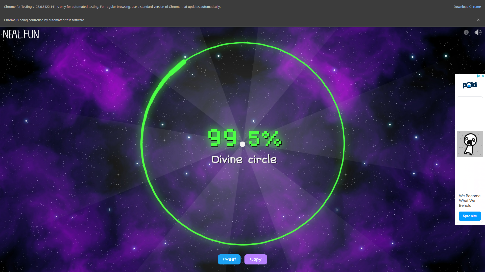

# Draw a Circle

## About Project

***

I appeared accidentally on the [Perfect Circle site](https://neal.fun/perfect-circle/).
And I was destroyed by 80-90% results, I wanted more.
So I've created a script that opens webdriver, go to that website and finally draw almost 100%. 



<br>

## How to start

***

### Application

Just install and run [draw circle app](dist)

### Command

```shell
pip install -r requirements.txt
python main.py
```

<br>

## Contact

***

<div>
    <a href="https://t.me/dhmmmhb" style="margin-right:90px;"></a>
    <a href="https://github.com/dNhCm" style="margin-right:90px;"></a>
    <a href="https://www.linkedin.com/in/daniel-m-601796308/" style="margin-right:90px;"></a>
</div>

<br>
